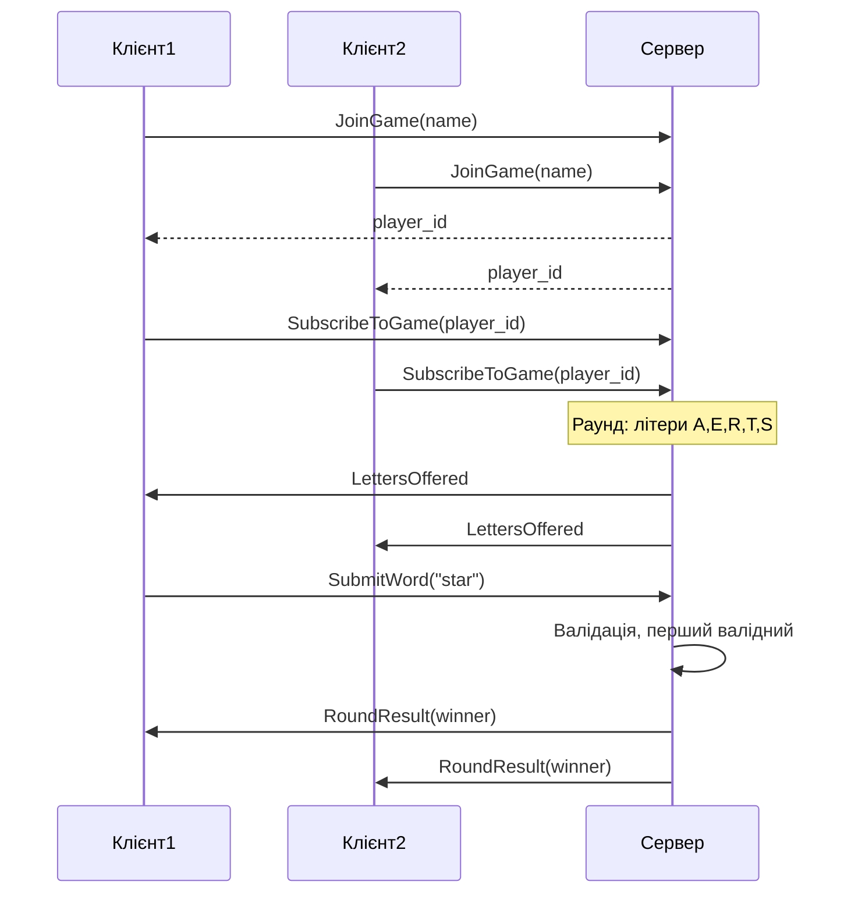

# Word Game — gRPC клієнт-сервер
Вернік Михайло - КП-в41ф
<br>
Варіант 13

Мультиплеєрна гра: гравці отримують набір літер, перший валідний варіант виграє раунд.

**Потрібно:** .NET 9.0 SDK

**Запуск:**
```bash
cd WordGame
dotnet run --project WordGame.Server
```

 **http://localhost:5119** . Ввести ім’я - Connect - чекати літери - ввести слово - Submit (або Enter).


**Структура:** WordGame.Server — ASP.NET Core (gRPC + Blazor).

**gRPC та Proto:** Контракт описано в `Protos/wordgame.proto`. Сервіс `WordGame` має 3 RPC: `JoinGame` (простий), `SubscribeToGame` (серверний стримінг — літери та результати), `SubmitWord` (простий). Повідомлення: JoinRequest/Response, SubscribeRequest, GameEvent (LettersOffered, RoundResult), SubmitWordRequest/Response.

**Схема взаємодії:**


